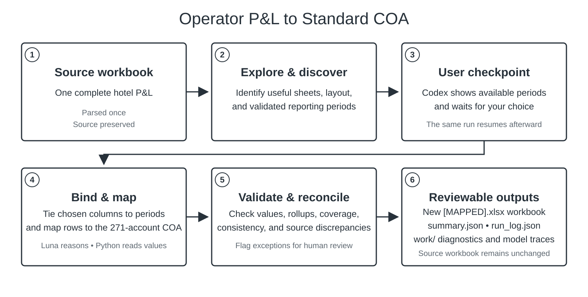

# Hotel P&L Normalizer CLI

Turn an operator hotel P&L into the bundled 271-account Standard COA while preserving the source workbook and a source-row audit trail.

For a first run, follow the [non-technical getting started guide](./GETTING_STARTED.md). It explains how to download this repository as a ZIP from GitHub, open it as a Codex project, and run workbooks by talking to Codex. You do not need to type commands into PowerShell yourself.



## What it does

- Reads one complete `.xlsx`, `.xlsm`, or `.xls` hotel P&L without overwriting it.
- Explores the workbook, identifies useful sheets, and discovers available reporting periods.
- Pauses so the user can choose one or more validated periods.
- Maps source rows into the Standard COA with OpenAI `gpt-5.6-luna`.
- Reads values and performs arithmetic and validation in Python rather than asking the model to calculate them.
- Writes a new mapped workbook, a run summary, a source-row audit log, and diagnostic artifacts.

See the [project catalog](./CATALOG.md) for a short guide to the workflow, output files, and main folders.

## What a completed run creates

| Output | Purpose |
| --- | --- |
| `[source name] [MAPPED].xlsx` | The operator P&L mapped into the Standard COA template. |
| `summary.json` | Plain run status, periods mapped or dropped, cost, duration, and model usage. |
| `run_log.json` | Source-row mapping and audit details. |
| `work/` | Detailed intermediate artifacts for review and troubleshooting. |

A successful run normally has `"accepted": true` in `summary.json`. Some qualified source discrepancies may be retained and clearly flagged for human review rather than changed to force a tie.

## How it is designed

The package has one production workflow: ingest once, discover periods, wait for the user's selection, bind selected columns, map, validate, and write the result atomically.

OpenAI `gpt-5.6-luna` is the only model adapter shipped today. The workflow depends on a supplier-neutral `ModelClient` contract, so a future Fireworks or Gemini adapter can replace the model client without creating a second mapping workflow.

## Requirements

- Windows, macOS, or Linux
- Python 3.11 or newer
- An OpenAI API key with access to `gpt-5.6-luna`
- A complete hotel P&L workbook

Runs make paid OpenAI API calls and commonly take 10–20 minutes. Workbook-derived financial data is sent to the OpenAI API for analysis. Keep the source workbook and generated run files in an approved location.

## Developer and terminal use

The [getting started guide](./GETTING_STARTED.md) is the recommended path for a coworker using Codex. For direct terminal setup on Windows:

```powershell
py -3.11 -m venv .venv
.\.venv\Scripts\python.exe -m pip install --upgrade pip
.\.venv\Scripts\python.exe -m pip install .
$env:OPENAI_API_KEY = "paste-your-key-here"
.\.venv\Scripts\hotel-pl-normalizer.exe --doctor
```

Run interactively:

```powershell
.\.venv\Scripts\hotel-pl-normalizer.exe "C:\P&Ls\Hotel.xlsx" "C:\P&Ls\Hotel-normalized"
```

The CLI lists validated periods and waits for one number, multiple comma-separated numbers, or Enter to accept its recommendation. Unattended alternatives are available through `--actual-and-prior`, `--annual-periods N`, `--period-id`, and `--recommended`.

`--doctor` checks Python, dependencies, bundled assets, and the API-key setting without displaying the key or making an API call.

To update a Git clone, pull the latest `main` branch and reinstall the local package. Someone using **Download ZIP** can instead download and unzip a fresh copy, then ask Codex to repeat the setup check.

## Troubleshooting

- `OPENAI_API_KEY is not configured`: add the key as described in [Getting Started](./GETTING_STARTED.md), then completely close and reopen Codex.
- `Python 3.11+ is required`: install a current Python release from [python.org](https://www.python.org/downloads/), then ask Codex to retry setup.
- A period is missing: review `summary.json` for `dropped_periods`; the CLI does not silently substitute Budget, Forecast, or a partial period.
- A run stops or fails validation: keep the source workbook, `summary.json`, `run_log.json`, and `work/` directory together for diagnosis.
